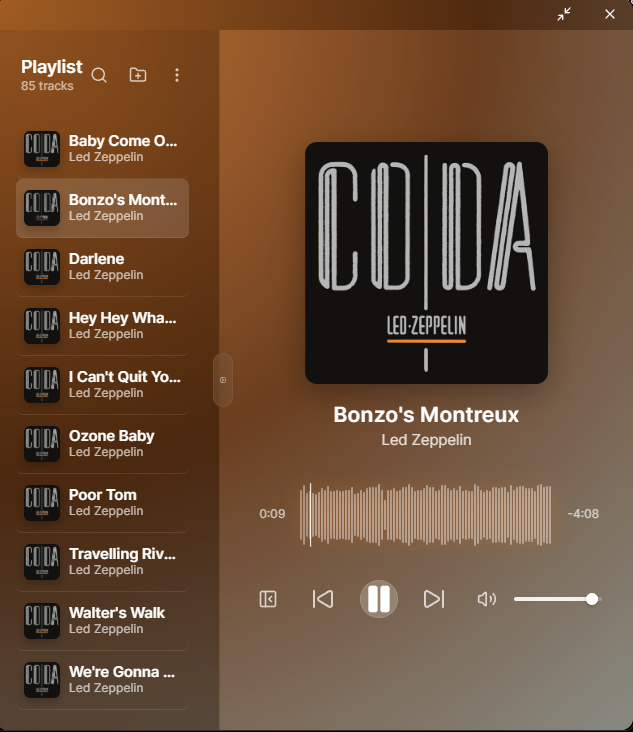
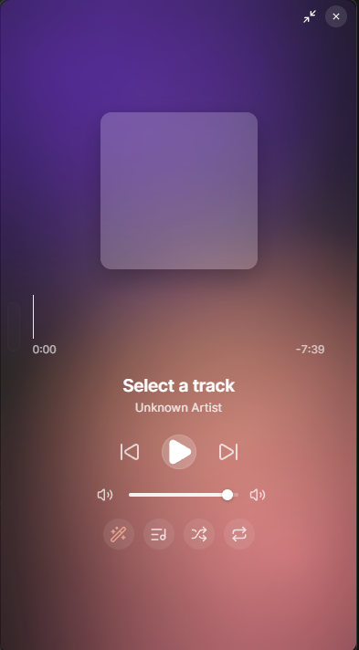

# Quaver

Quaver is a fun, beautiful, lightweight music player for Windows. It is built for local music collections: fast folder imports, rich album art, silky waveforms, and a warm animated interface that feels closer to a favorite object than a file browser.

No account. No streaming service. Just your music, made lovely.

<p align="center">
  
</p>

<p align="center">
  
</p>

## Highlights

- Beautiful local playback with a compact, phone-like window shape
- Browse by songs, albums, folders, and custom playlists
- Sort your library by artist, album, or title
- Search quickly across your collection
- Hide the music shelf for a clean now-playing mode
- Seek through songs with a cached waveform display
- Enjoy subtle audio-reactive background motion themed from the current album art
- Shuffle, repeat, volume, and queue controls built for everyday use

## Smart By Default

Quaver tries to do the tedious bits for you:

- Automatically scans imported folders for `mp3`, `wav`, `flac`, `ogg`, `m4a`, `aac`, and `opus` files
- Automatically loads album art from embedded tags
- Automatically checks nearby sidecar images like cover art in the same folder
- Automatically falls back to the iTunes Search API when local art is missing
- Automatically caches album art and waveform peaks locally for faster future launches
- Automatically recovers missing metadata using AcoustID audio fingerprinting when possible
- Automatically opens, imports, queues, and plays audio files when Quaver is set as the Windows default music player

## Install

Download the latest Windows installer from the [GitHub Releases page](https://github.com/niallm21/quaver/releases).

For this build, the Windows installers are also included in the repository:

- `src-tauri/target/release/bundle/nsis/Quaver_1.0.3_x64-setup.exe`
- `src-tauri/target/release/bundle/msi/Quaver_1.0.3_x64_en-US.msi`

After installing, you can set Quaver as the default app for MP3s and other supported audio files. Double-clicking a song in Explorer should open Quaver, import it, and start playback.

## Built With

- [Tauri 2](https://tauri.app/) for the Windows desktop shell
- [React](https://react.dev/) and TypeScript for the interface
- Rust for scanning, metadata, album art, waveform generation, and the local database
- SQLite for local library, playlist, art, and waveform caches

## Development

```sh
npm install
npm run tauri dev
```

You can also use:

```sh
launch.bat
```

## Build

```sh
npm run tauri build
```

The Windows installers will be created under:

```text
src-tauri/target/release/bundle/
```

## Project Status

Quaver is currently a personal Windows music player in early release. The focus is simple: keep it fast, local-first, beautiful, and pleasant enough that opening your music library feels like a small ritual.
